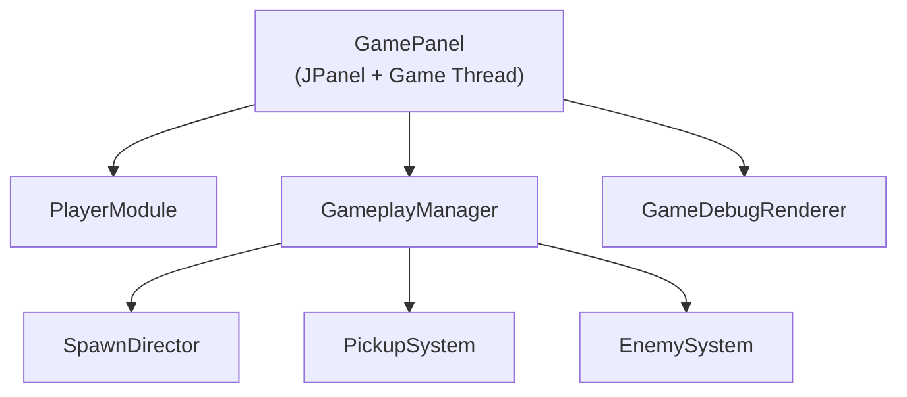
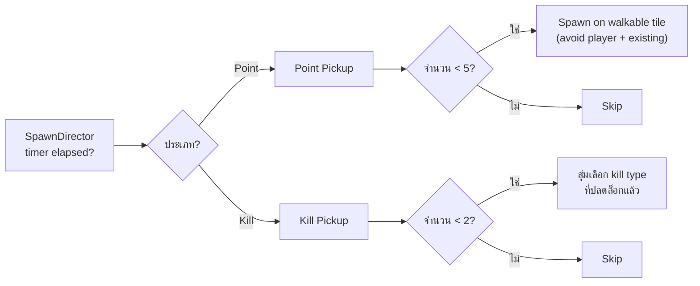
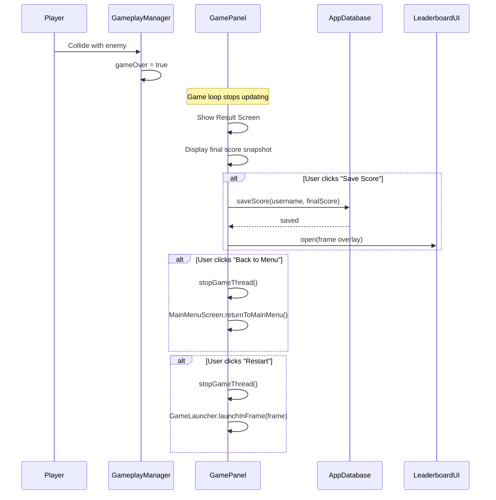

# 🎮 Gameplay Flow — อยุธยา พาซิ่ง!

> ระบบเกมเพลย์ฉบับเต็ม — อธิบาย Game Loop, ศัตรู, ไอเท็ม, AI, และการปรับค่า

---

## 1. Runtime Architecture



| Component | หน้าที่ |
|-----------|--------|
| **GamePanel** | Game loop thread, rendering, input handling, pause/result menus |
| **PlayerModule** | Keyboard → Direction → Player movement + collision |
| **GameplayManager** | Orchestrator: สั่ง spawn, collect, detect collision |
| **SpawnDirector** | นับเวลา, ปลดล็อก Stage, จัดคิว spawn |
| **PickupSystem** | สร้าง/เก็บ/แสดง Point และ Kill pickup |
| **EnemySystem** | สร้าง/ย้าย/ฆ่า/แสดง ตำรวจ + AI movement |
| **GameDebugRenderer** | แสดง debug overlay (grid, hitbox, collision, debug HUD) |

---

## 2. Game Loop (Fixed-Timestep)

```
┌────────────────────────────────────────────────────┐
│  1. วัด wall-clock delta time                        │
│  2. สะสมเข้า accumulator                             │
│  3. While accumulator ≥ 1/120s (8.33ms):            │
│     ├─ PlayerModule.update(1/120s)                   │
│     │   ├─ อ่าน keyboard → desired direction         │
│     │   ├─ Player.setDirection()                     │
│     │   ├─ Player.update() — animation frame         │
│     │   └─ Player.move() — collision + position      │
│     └─ GameplayManager.update(1/120s)                │
│         ├─ SpawnDirector.update() — stage/timers     │
│         ├─ Spawn pickups (point/kill)                │
│         ├─ Spawn enemies                             │
│         ├─ EnemySystem.update() — AI movement        │
│         ├─ Collect pickups → score + kill effects    │
│         └─ Enemy-player collision → Game Over?       │
│  4. repaint() → paintComponent()                     │
│     ├─ Maze.render() — background + walls            │
│     ├─ GameplayManager.render() — pickups + enemies  │
│     ├─ PlayerModule.render() — player sprite         │
│     ├─ Debug overlays (if F1 enabled)                │
│     └─ HUD (statue icon + current score)             │
│  5. Sleep to target ~60fps                           │
└────────────────────────────────────────────────────┘
```

> **หมายเหตุ:** เมื่อ `pauseMenuOpen == true`, PlayerModule และ GameplayManager จะ **ไม่** ถูก update — เวลาเกมหยุดนิ่ง

---

## 3. Stage Progression Timeline

```mermaid
gantt
    title Stage Unlock Timeline
    dateFormat X
    axisFormat %s s

    section Stage 1
    police_fat only : 0, 30

    section Stage 2
    + police_car : 30, 70

    section Stage 3
    + police_chicken : 70, 120
```



| Stage | เวลา (วินาที) | ตำรวจที่ปลดล็อก |
|-------|:-------------:|----------------|
| 1 | 0s | **ตำรวจอ้วน** (FAT) เท่านั้น |
| 2 | 30s | + **รถตำรวจ** (CAR) |
| 3 | 70s | + **ไก่ตำรวจ** (CHICKEN) |

ค่าเหล่านี้ตั้งไว้ใน `GameplayConfig.STAGE_*_TIME`

---

## 4. Enemy Types

| ประเภท | Asset | ความเร็ว (× ผู้เล่น) | Stage | จำนวนสูงสุด |
|--------|-------|:--------------------:|:-----:|:-----------:|
| 🟦 **FAT** | `police_fat.png` | 0.45× | 1 | 2 ตัว |
| 🟧 **CAR** | `police_car.png` | 0.70× | 2 | 2 ตัว |
| 🟪 **CHICKEN** | `police_chicken.png` | 1.00× | 3 | 1 ตัว |

### Enemy AI — การเคลื่อนที่

```mermaid
flowchart TD
    A["ศัตรูเดินตรง"]
    B{"ผ่านจุดกลาง tile?"}
    C{"ทางแยก?"}
    D["เดินต่อ (ทางตรง)"]
    E{"สุ่ม < 70%?"}
    F["เลือกทาง ที่ใกล้ผู้เล่นที่สุด\n(Manhattan Distance)"]
    G["เลือกทาง สุ่ม\n(ไม่ย้อนกลับ)"]
    H["เปลี่ยนทิศ + ชะลอความเร็ว"]
    I{"ถนนตัน?"}
    J["หยุด → สุ่มทิศใหม่"]

    A --> B
    B -->|ไม่| A
    B -->|ใช่| C
    C -->|ไม่ (ทางตรง)| D --> A
    C -->|ใช่| E
    E -->|ใช่ (70%)| F --> H --> A
    E -->|ไม่ (30%)| G --> H --> A
    I -->|ใช่| J --> A
```

### Turn Slowdown (ชะลอเมื่อเลี้ยว)

เมื่อศัตรูเลี้ยว:
1. ความเร็วลดลงเหลือ **35%** ของ base speed ทันที
2. ค่อยๆ เร่งกลับเป็นเต็ม ใน **0.45 วินาที** (linear interpolation)
3. ทำให้ผู้เล่นมีโอกาสหนีเมื่อศัตรูเลี้ยวตาม

### Spawn & Respawn

| พารามิเตอร์ | ค่า | อธิบาย |
|------------|:---:|--------|
| Spawn check interval | 4s | ตรวจทุก 4 วินาทีว่าต้อง spawn ไหม |
| Min distance from player | 8 tiles | spawn ห่างจากผู้เล่นอย่างน้อย 8 ช่อง |
| Max spawn attempts | 200 | ลองหาตำแหน่ง spawn ไม่เกิน 200 ครั้ง |
| Respawn cooldown | 8s | หลังถูกฆ่า รอ 8 วินาทีแล้ว spawn ใหม่ |
| Respawn retry delay | 0.75s | หาที่ spawn ไม่เจอ → ลองใหม่ใน 0.75s |

---

## 5. Pickup Types

| Pickup | Asset | เอฟเฟกต์ |
|--------|-------|---------|
| 🟡 **POINT** | `object_point.png` | +1 คะแนน |
| 🔴 **KILL_FAT** | `kill_fat_00000.png` | ฆ่าตำรวจอ้วนทั้งหมด + 2 คะแนน |
| 🟠 **KILL_CAR** | `kill_car_00000.png` | ฆ่ารถตำรวจทั้งหมด + 2 คะแนน |
| 🟣 **KILL_CHICKEN** | `kill_chicken_00000.png` | ฆ่าไก่ตำรวจทั้งหมด + 2 คะแนน |

### Spawn Rules



| พารามิเตอร์ | ค่า |
|------------|:---:|
| Max point pickups | 5 |
| Point spawn interval | 2s |
| Max kill pickups | 2 |
| Kill spawn cooldown | 12s |
| Max spawn attempts | 300 |

---

## 6. Interaction Matrix

| เอนทิตี้ A | เอนทิตี้ B | ผลลัพธ์ |
|-----------|-----------|---------|
| ผู้เล่น | POINT | คะแนน += 1, pickup หายไป |
| ผู้เล่น | KILL_X | ตำรวจ type X ตายทั้งหมด, คะแนน += 2 |
| ผู้เล่น | ตำรวจ | **Game Over!** (เก็บ final score snapshot แล้วค่อยหักคะแนนใน state ปัจจุบัน) |
| ตำรวจ | ตำรวจ | ไม่มีปฏิสัมพันธ์ |
| ตำรวจ | Pickup | ไม่มีปฏิสัมพันธ์ |

---

## 7. Game Over Flow



---

## 8. Maze Shuffle (แผนที่สลับอัตโนมัติ)

ถ้าตั้งค่าใน `resources/maze/shuffle_config.txt`:

```ini
enabled = true
intervalSeconds = 45
maze = maze_v2_layout_1-edited
maze = maze_v2_layout_2-edited
```

ระบบจะ:
1. นับเวลาเกม (ไม่นับตอน pause)
2. ทุก 45 วินาที สลับไปแผนที่ถัดไป (สุ่ม)
3. ย้ายศัตรู/pickup ที่ติดผนังไปตำแหน่งใหม่ (reconcile)
4. ลบศัตรู/pickup ที่หาที่ใหม่ไม่ได้

ผู้เล่นยังอยู่ตำแหน่งเดิม — ถ้าตำแหน่งเดิมเป็นผนังจะถูก clamp

---

## 9. Pause Overlay

| ปุ่ม | ผลลัพธ์ |
|------|---------|
| **Resume** | ปิด pause overlay, เกมเล่นต่อ |
| **Restart** | หยุด thread → สร้าง GamePanel ใหม่ใน window เดิม |
| **Exit** | กลับเมนูหลัก (MainMenuScreen) ใน window เดิม |

กด **ESC** เพื่อเปิด/ปิด pause overlay แบบสรุปสถานะปัจจุบัน (Score, Stage, Time, Maze)

---

## 10. Debug Mode (สำหรับ Dev)

กด **F1** ในเกมเพื่อเปิด Debug Mode จากนั้นกดปุ่มต่อไปนี้:

| ปุ่ม | Overlay |
|------|---------|
| F1 | เปิด/ปิด Debug Mode ทั้งหมด |
| F2 | แสดง Grid เขาวงกต |
| F3 | แสดง Walkable Tiles (สีเขียว/แดง) |
| F4 | แสดง Player Hitbox |
| F5 | แสดง Collision Sample Points |
| F6 | แสดง/ซ่อน Debug HUD |
| F7 | แสดง Recent Collision Checks |

---

## 11. Key Tuning Knobs (GameplayConfig)

| ค่าคงที่ | Default | อธิบาย |
|---------|:-------:|--------|
| `STAGE_2_TIME` | 30.0s | เวลาปลดล็อก Stage 2 (CAR) |
| `STAGE_3_TIME` | 70.0s | เวลาปลดล็อก Stage 3 (CHICKEN) |
| `MAX_FAT_ENEMIES` | 2 | จำนวน FAT สูงสุดพร้อมกัน |
| `MAX_CAR_ENEMIES` | 2 | จำนวน CAR สูงสุดพร้อมกัน |
| `MAX_CHICKEN_ENEMIES` | 1 | จำนวน CHICKEN สูงสุดพร้อมกัน |
| `ENEMY_SPAWN_INTERVAL` | 4.0s | ระยะเวลาระหว่าง spawn check |
| `ENEMY_RESPAWN_DELAY` | 8.0s | เวลารอหลังถูกฆ่าก่อน respawn |
| `ENEMY_MIN_SPAWN_DISTANCE_TILES` | 8 | ระยะห่างขั้นต่ำจากผู้เล่น (tiles) |
| `TURN_SLOWDOWN_FACTOR` | 0.35 | ตัวคูณความเร็วตอนเลี้ยว |
| `TURN_RECOVERY_SECONDS` | 0.45s | เวลาฟื้นความเร็วหลังเลี้ยว |
| `ENEMY_CHASE_BIAS` | 0.70 | ความน่าจะเป็นในการไล่ล่า (70%) |
| `MAX_POINT_PICKUPS` | 5 | Point pickup สูงสุดบนแผนที่ |
| `POINT_SPAWN_INTERVAL` | 2.0s | ระยะระหว่าง point spawn |
| `POINT_SCORE_VALUE` | 1 | คะแนนต่อ point pickup |
| `MAX_KILL_PICKUPS` | 2 | Kill pickup สูงสุดบนแผนที่ |
| `KILL_SPAWN_COOLDOWN` | 12.0s | cooldown ระหว่าง kill spawn |
| `ENEMY_TOUCH_PENALTY` | 30 | คะแนนที่หักเมื่อโดนตำรวจ |
| `PLAYER_INVINCIBILITY_SECONDS` | 2.0s | ~~เวลาอยู่ยง~~ *(ปัจจุบัน: Game Over ทันที)* |

---

## 12. File Map

```
src/
├── Main.java                          ← Entry Point + CLI dispatch
├── menu/                              ← 5 classes: Login/Register/Menu
├── game/
│   └── GameLauncher.java              ← Creates GamePanel in JFrame
├── panels/
│   ├── GamePanel.java                 ← 810 LOC: Game Loop + Rendering
│   └── GameDebugRenderer.java         ← Debug Overlays
├── core/
│   ├── config/
│   │   ├── PlayerConfig.java          ← Player physics constants
│   │   └── ProjectPaths.java          ← File/directory path resolver
│   ├── data/
│   │   ├── AppDatabase.java           ← SQLite: users + leaderboard
│   │   └── LeaderboardUI.java         ← Custom painted leaderboard overlay
│   ├── debug/
│   │   ├── DebugSettings.java         ← F-key toggle flags
│   │   └── PlayerDebugSnapshot.java   ← Per-frame debug data
│   ├── entities/
│   │   ├── Entity.java                ← Abstract base (position, bounds)
│   │   ├── Player.java                ← Movement, sprites, collision
│   │   └── Direction.java             ← Enum: UP/DOWN/LEFT/RIGHT/NONE
│   ├── gameplay/
│   │   ├── GameplayConfig.java        ← All tuning constants
│   │   ├── GameplayManager.java       ← Top-level orchestrator
│   │   ├── SpawnDirector.java         ← Time + stage + spawn timers
│   │   ├── EnemySystem.java           ← Enemy lifecycle + AI
│   │   ├── EnemyState.java            ← Per-enemy runtime state
│   │   ├── EnemyType.java             ← FAT / CAR / CHICKEN enum
│   │   ├── PickupSystem.java          ← Pickup lifecycle
│   │   ├── PickupState.java           ← Per-pickup runtime state
│   │   └── PickupType.java            ← POINT / KILL_* enum
│   ├── level/
│   │   ├── Maze.java                  ← Tile grid + background + spawn zone
│   │   ├── io/                        ← File I/O (6 classes)
│   │   └── mapv2/                     ← Fallback wall layouts (3 classes)
│   └── player/
│       ├── CollisionMap.java          ← Interface
│       ├── MazeCollisionMapAdapter.java
│       ├── MapV2CollisionMap.java
│       ├── CollisionDebugInfo.java
│       ├── PlayerController.java      ← Keyboard → Direction
│       └── PlayerModule.java          ← Facade: Controller+Player+Collision
└── editor/                            ← 5 classes: Maze Editor
```
