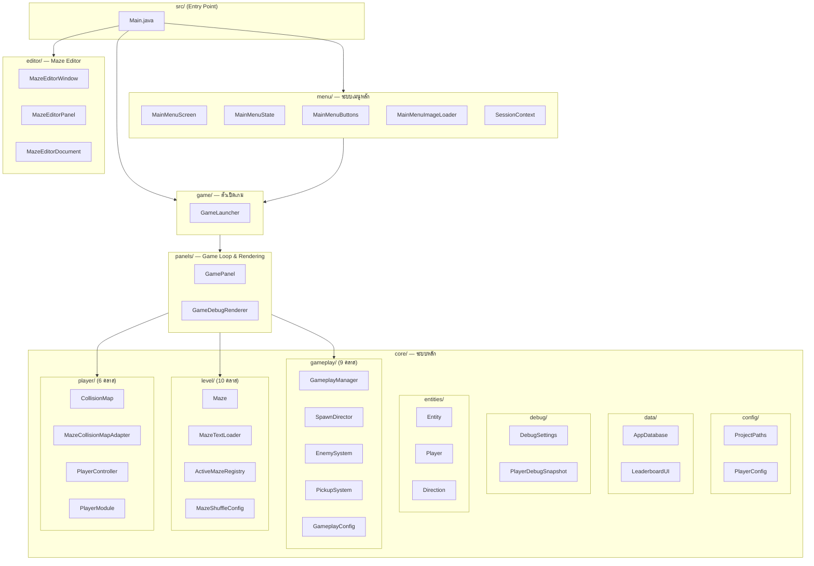
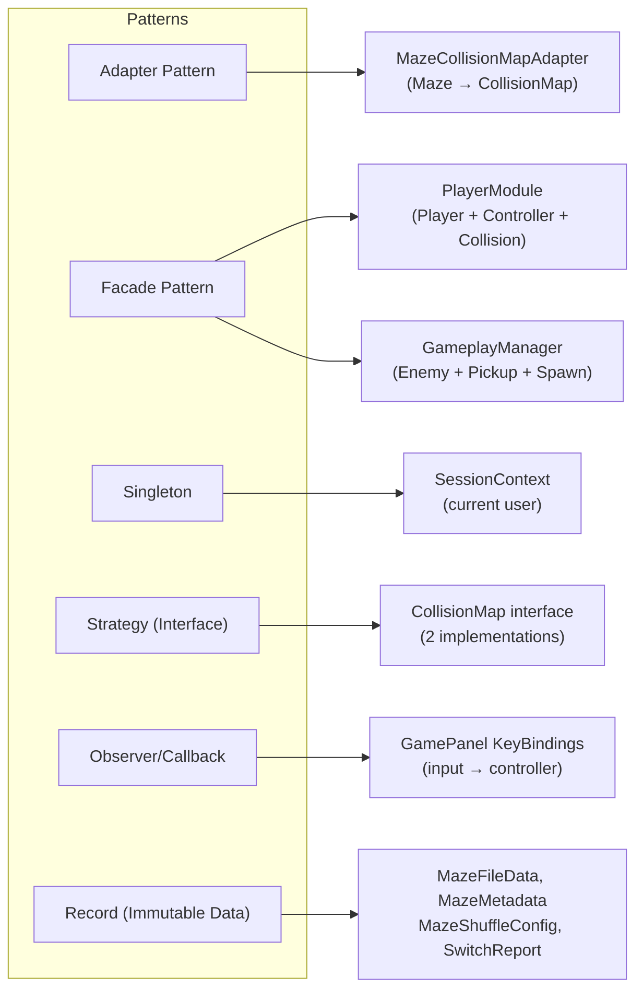
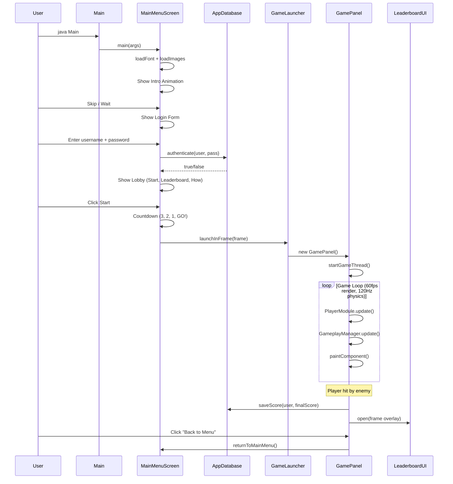
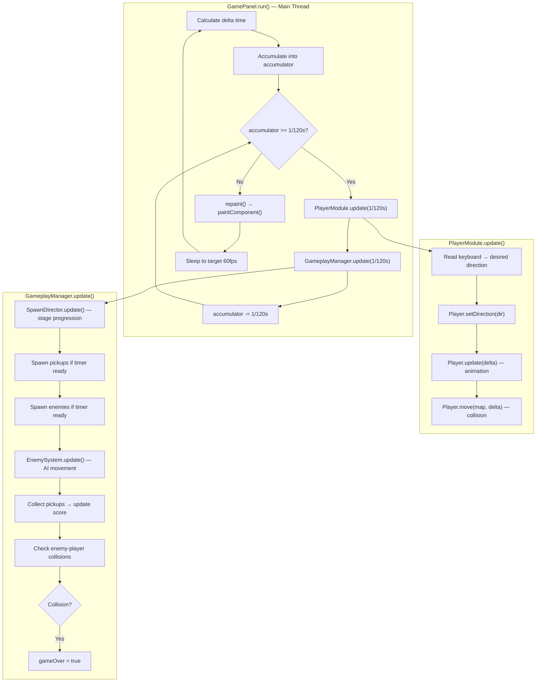
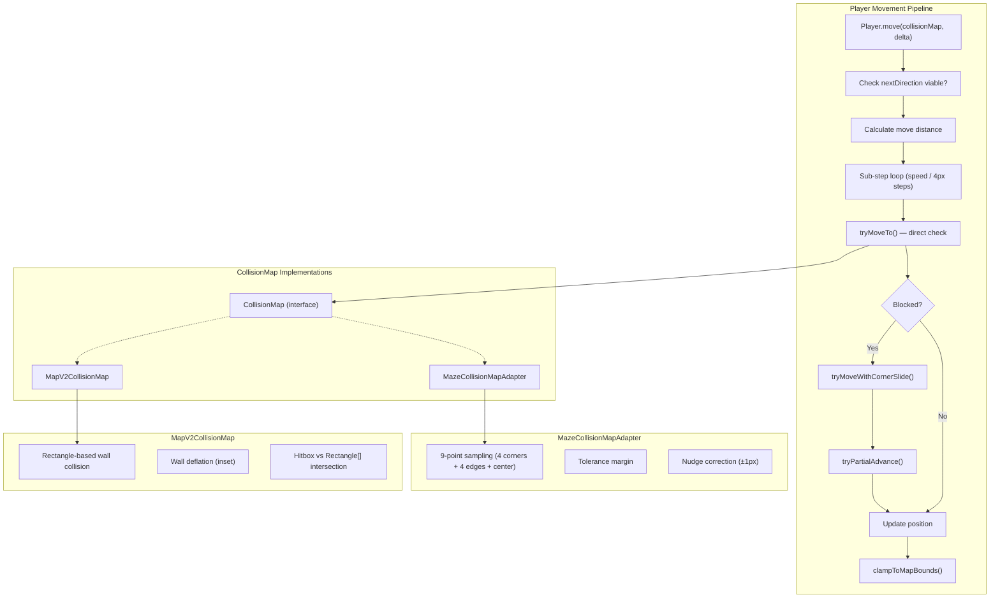
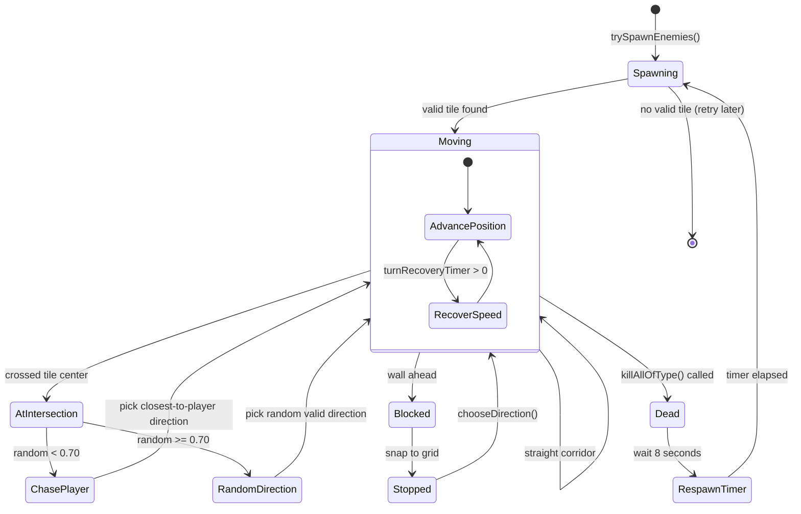
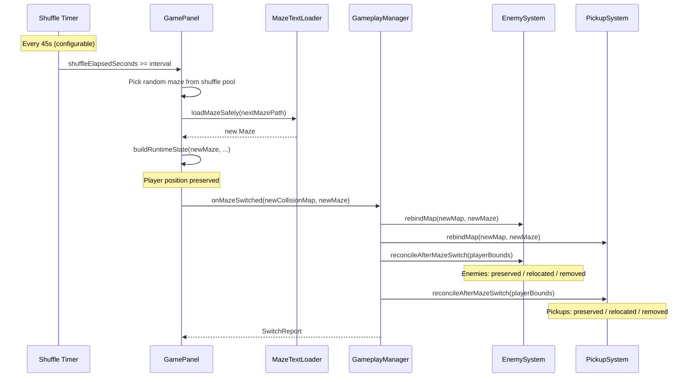
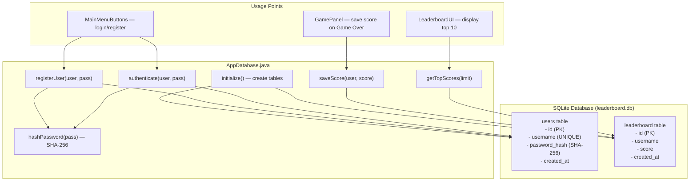
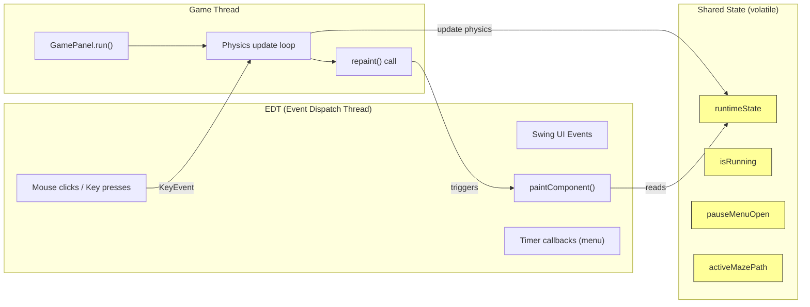

# 🏛️ Architecture Overview — อยุธยา พาซิ่ง!

> สถาปัตยกรรมโปรแกรมฉบับเต็ม — อธิบายโครงสร้าง, หลักการออกแบบ, และ Data Flow

---

## 1. ภาพรวมแพ็กเกจ (Package Map)



---

## 2. หลักการออกแบบ (Design Principles)

### 2.1 Separation of Concerns (แยกหน้าที่)

| Layer | หน้าที่ | ตัวอย่าง |
|-------|--------|---------|
| **Entry** | จุดเริ่มต้น + CLI dispatch | `Main.java` |
| **UI/Menu** | หน้าจอเมนู, Login/Register, Animation | `menu.*` (5 คลาส) |
| **Game Launch** | สร้าง GamePanel + ใส่ใน JFrame | `GameLauncher` |
| **Game Loop** | Fixed-timestep update + rendering | `GamePanel` |
| **Gameplay** | Score, Enemy AI, Pickup spawn | `core.gameplay.*` |
| **Entities** | ตัวละคร, movement, sprites | `core.entities.*` |
| **Level** | โครงสร้างเขาวงกต, file I/O | `core.level.*` |
| **Collision** | ตรวจการชน, hitbox | `core.player.*` |
| **Data** | SQLite DB, Leaderboard overlay | `core.data.*` |
| **Config** | ค่าคงที่, path resolution | `core.config.*` |

### 2.2 Design Patterns ที่ใช้



### 2.3 ทำไมถึงออกแบบแบบนี้?

| การตัดสินใจ | เหตุผล |
|------------|--------|
| **CollisionMap เป็น interface** | รองรับ 2 ระบบ collision: tile-based (MazeCollisionMapAdapter) และ rect-based (MapV2CollisionMap) |
| **GameplayManager เป็น Facade** | รวม 3 subsystem (Enemy, Pickup, Spawn) ให้ GamePanel เรียก update/render จุดเดียว |
| **PlayerModule** | แยก Player logic (move, render) ออกจาก GamePanel — ลดความซับซ้อน |
| **Record ใน Java** | ใช้ Record สำหรับ immutable data (MazeFileData, MazeMetadata) — ปลอดภัย, concise |
| **EnumMap** | ใช้ EnumMap แทน HashMap สำหรับ Direction/EnemyType keys — เร็วกว่า, type-safe |

---

## 3. Application Lifecycle



---

## 4. Game Loop Architecture



---

## 5. Collision System Architecture



---

## 6. Enemy AI System



---

## 7. Maze Shuffle System



---

## 8. Data Layer Architecture



---

## 9. File System Layout

```
merged_final/
├── start_game.bat              ← Production launcher (ผู้ใช้)
├── dev/                        ← Dev tools
│   ├── run_test.bat            ← Full console output + debug keys
│   ├── run_game.bat            ← Game-only mode
│   ├── run_menu.bat            ← Menu-only mode
│   └── run_editor.bat          ← Maze Editor
│
├── src/                        ← Source code (48 Java files)
│   ├── Main.java               ← Entry point dispatcher
│   ├── menu/                   ← 5 classes — login/menu system
│   ├── game/                   ← 1 class — game launcher bridge
│   ├── panels/                 ← 2 classes — game loop + debug renderer
│   ├── core/
│   │   ├── config/             ← 2 classes — paths + player constants
│   │   ├── data/               ← 2 classes — database + leaderboard overlay
│   │   ├── debug/              ← 2 classes — debug toggles + snapshots
│   │   ├── entities/           ← 3 classes — entity hierarchy
│   │   ├── gameplay/           ← 9 classes — enemy/pickup/spawn systems
│   │   ├── level/              ← 10 classes — maze + file I/O
│   │   └── player/             ← 6 classes — collision + input
│   ├── editor/                 ← 5 classes — maze editor tool
│   ├── database/               ← UI images (bg_temple.png, ...)
│   └── images/                 ← Background images
│
├── resources/                  ← Game assets
│   ├── map/                    ← Maze background images
│   ├── maze/                   ← Maze layout text files
│   │   ├── active_maze_path.txt
│   │   └── shuffle_config.txt
│   ├── objects/                ← Enemy + pickup sprites
│   ├── sprites/thief/          ← Player sprites (idle + running)
│   └── ui/                     ← Menu UI images
│
├── lib/                        ← Dependencies
│   ├── sqlite-jdbc-3.45.1.0.jar
│   ├── slf4j-api-2.0.13.jar
│   └── slf4j-simple-2.0.13.jar
│
├── font/                       ← Custom Thai game font
├── db.properties               ← Database configuration
├── leaderboard.db              ← SQLite database (runtime)
│
├── docs/                       ← Documentation
│   ├── class_diagram.md        ← Complete class diagrams (Mermaid)
│   └── architecture.md         ← This file
│
├── GAMEPLAY_FLOW.md            ← Gameplay mechanics reference
└── README.md                   ← Project overview + grading criteria
```

---

## 10. Threading Model



**Thread Safety:**
- `runtimeState`, `isRunning`, `pauseMenuOpen`, `activeMazePath` ใช้ `volatile`
- `RuntimeState` เป็น `record` (immutable) — ปลอดภัยในการอ่านข้าม thread
- Input (KeyEvents) มาจาก EDT → เขียนลง `PlayerController` (EnumMap) → อ่านจาก Game Thread
- `repaint()` เรียกจาก Game Thread → `paintComponent()` ทำงานบน EDT

---

## 11. Exception Handling Strategy

| บริเวณ | Exception | การจัดการ |
|--------|-----------|----------|
| **Database** | `SQLException`, `ClassNotFoundException` | catch → แสดง error dialog / fallback |
| **File I/O** | `IOException` | catch → fallback to default maze / null sprite |
| **Sprite Loading** | `IOException` | catch → render fallback shape (circle/arc) |
| **Font Loading** | `FontFormatException` | catch → fallback to `new Font("Tahoma")` |
| **Maze Parsing** | `IllegalArgumentException` | throw → if rows empty or unequal width |
| **Null Arguments** | `IllegalArgumentException` | throw → `GameLauncher.launchInFrame(null)` |
| **DB Init Failure** | `IllegalStateException` | throw → wraps original exception |
| **Path Resolution** | `URISyntaxException` | catch → fallback to `user.dir` walking |
