# 📐 Class Diagram — อยุธยา พาซิ่ง!

> Complete class relationship diagram for all 48 classes in the project.

---

## 1. Top-Level Application Flow

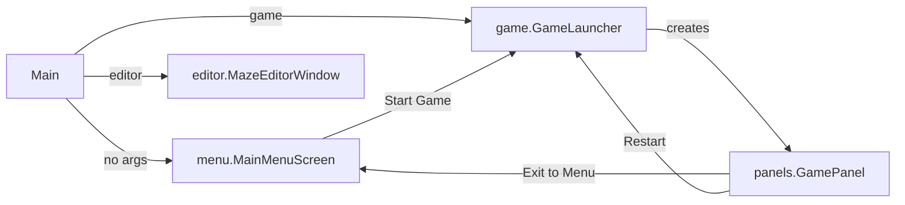

---

## 2. Menu Package (`menu.*`)

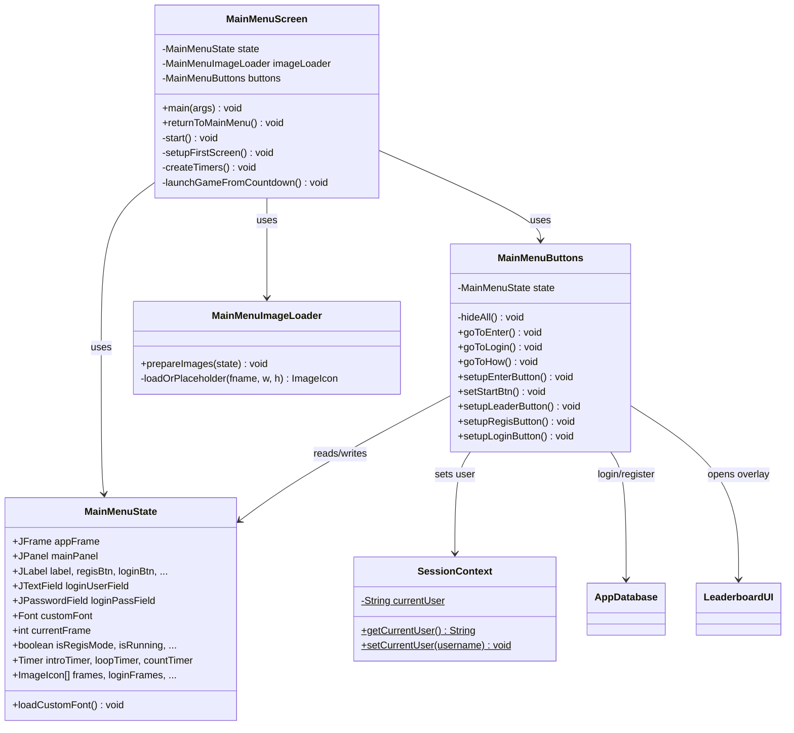

---

## 3. Game Panel (`panels.*`)

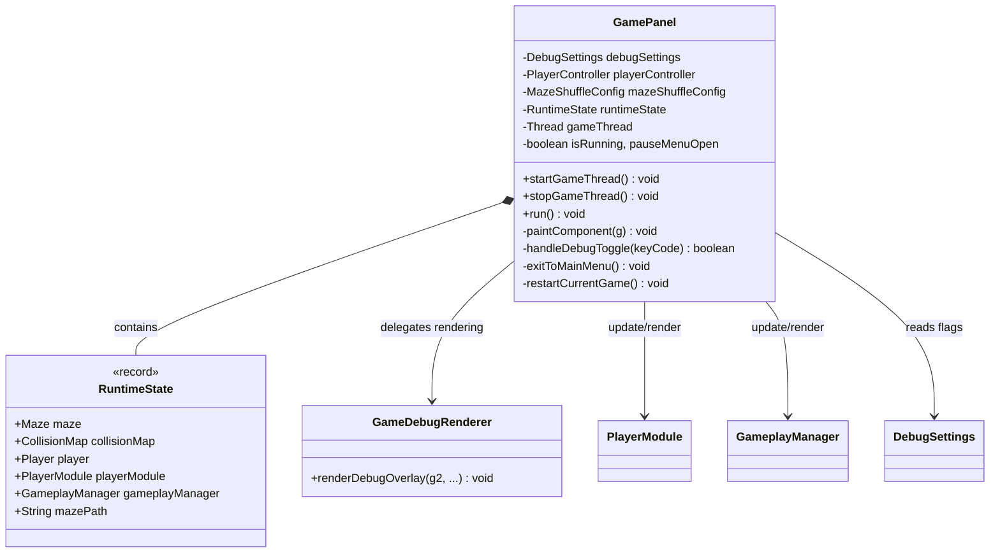

---

## 4. Core Entities (`core.entities.*`)

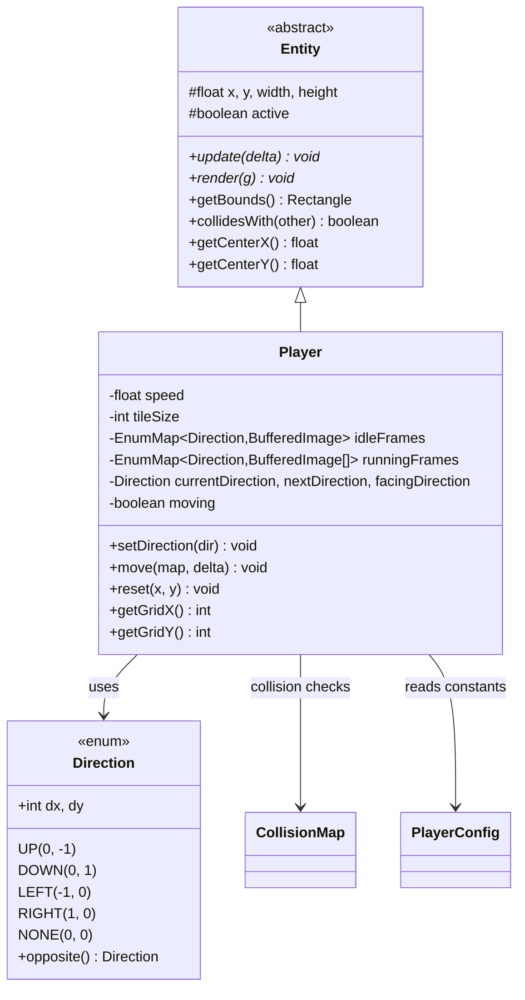

---

## 5. Gameplay System (`core.gameplay.*`)

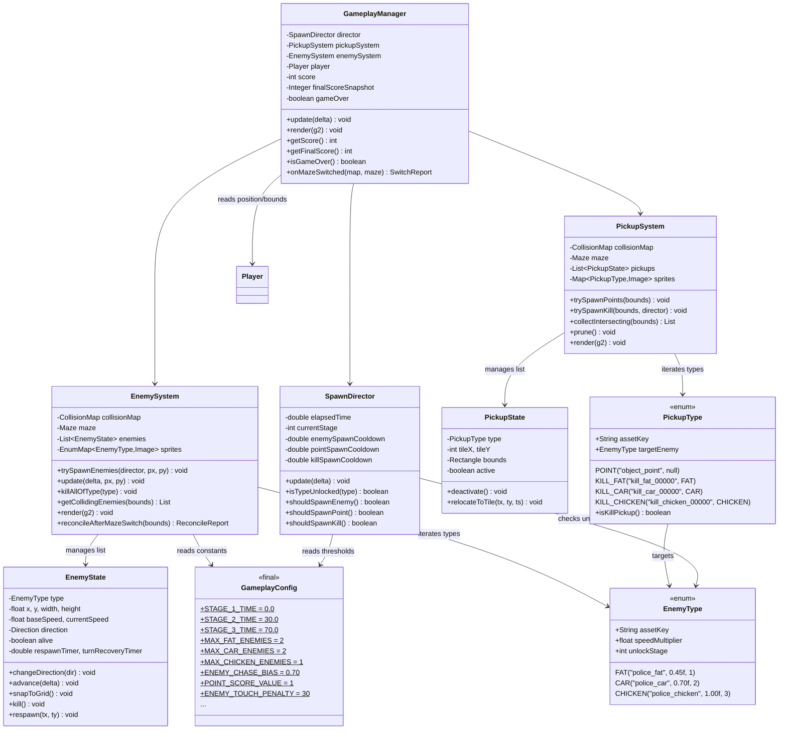

---

## 6. Level System (`core.level.*`)

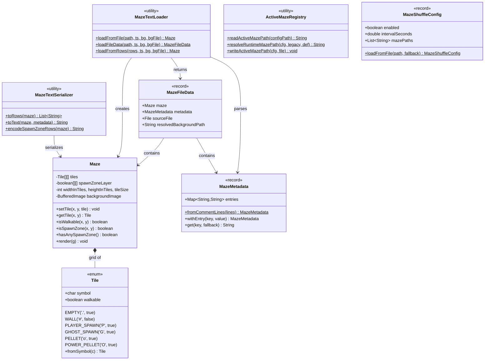

---

## 7. MapV2 Subsystem (`core.level.mapv2.*`)

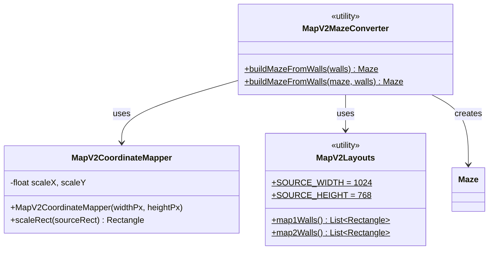

---

## 8. Player / Collision System (`core.player.*`)

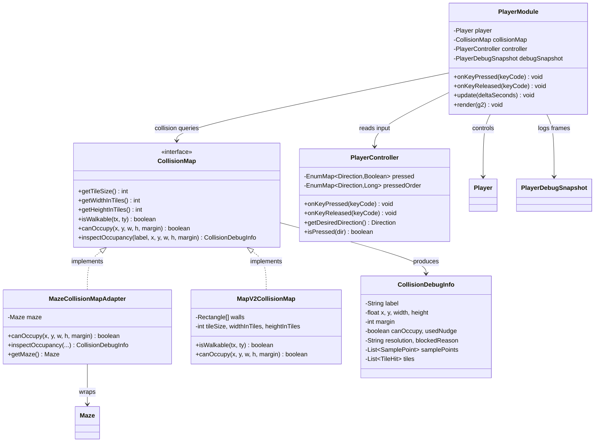

---

## 9. Config & Data (`core.config.*`, `core.data.*`)

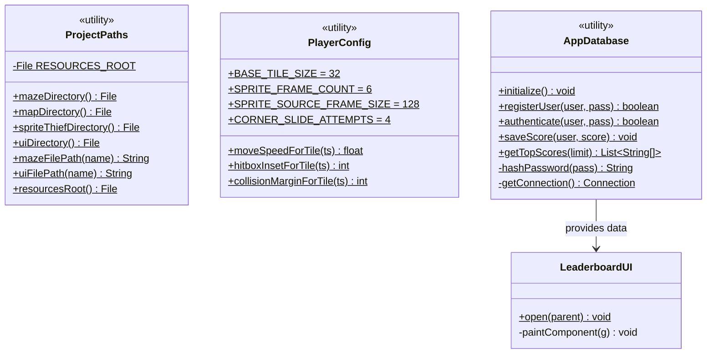

---

## 10. Editor Package (`editor.*`)

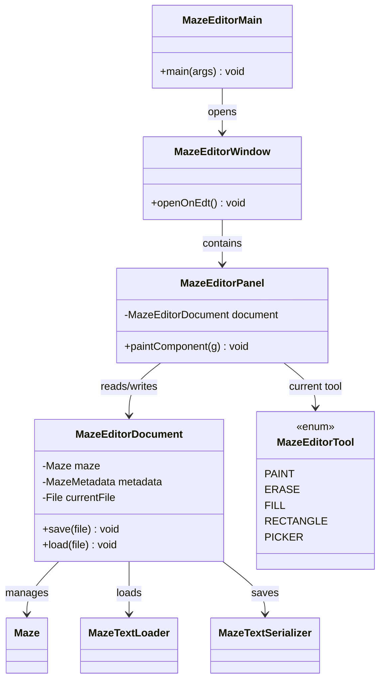

---

## 11. Debug System (`core.debug.*`)

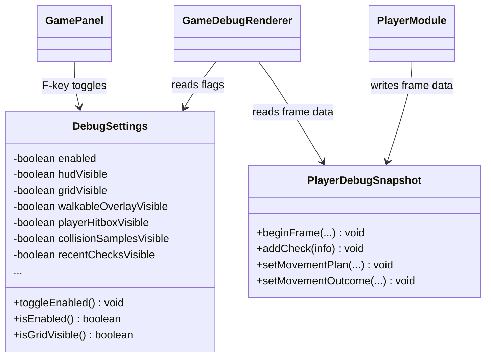

---

## 12. Full Dependency Overview

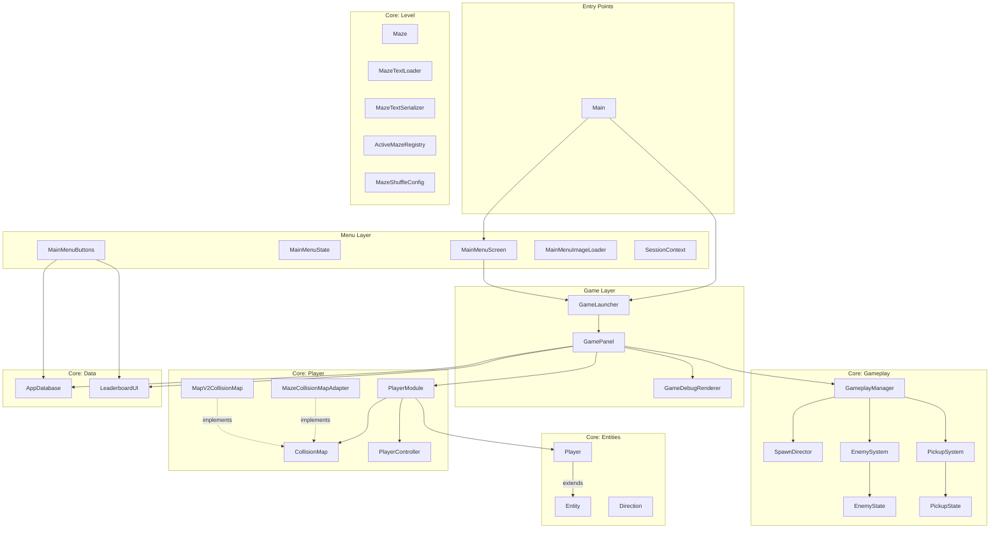
